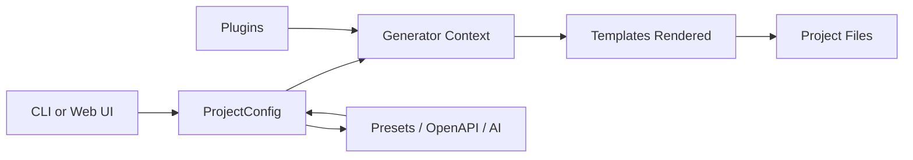

# Architecture

This document explains how **mcp-new** is organized internally and how the main building blocks fit together.

## High-Level Flow

## Code Map

| Area | Purpose | Key Paths |
|------|---------|----------|
| CLI entry | Parse flags and route to commands | `src/cli.ts`, `src/commands/` |
| Generators | Create projects from config | `src/generators/` |
| Templates | EJS templates for each language | `src/templates/` (source), `templates/` (built) |
| Prompts | Wizard steps and defaults | `src/prompts/` |
| Presets | Built-in tool sets | `src/presets/` |
| Marketplace | External preset fetching and cache | `src/marketplace/` |
| Plugins | Language extension system | `src/plugins/`, `src/types/plugin.ts` |
| Parsers | OpenAPI parsing | `src/parsers/` |
| Web UI | Local web generator and API | `src/web-server/` |
| Docs server | Local docs site | `src/docs-server/` |
| Utilities | FS, git, validation, logging | `src/utils/` |

## Core Data Model

All flows produce a `ProjectConfig`. It is the single source of truth passed into generators.

| Field | Type | Notes |
|------|------|------|
| `name` | string | Project folder name |
| `description` | string | Used in templates and README |
| `language` | string | Built-in or plugin language id |
| `transport` | `"stdio" \| "sse"` | Protocol transport |
| `tools` | array | Tool definitions |
| `resources` | array | Resource definitions |
| `prompts` | array | Prompt templates |
| `sampling` | object | Sampling helper config |
| `includeExampleTool` | boolean | Adds a sample tool if true |
| `skipInstall` | boolean | Skips dependency installation |
| `initGit` | boolean | Initializes git repo |
| `javaBuildTool` | `"maven" \| "gradle"` | Java/Kotlin only |

Source: `src/types/config.ts`.

## Generator Pipeline

Generators are thin orchestration layers around `BaseGenerator`.

### BaseGenerator Responsibilities

| Step | What it does | Where |
|------|-------------|------|
| Output safety | Ensure output directory is empty | `BaseGenerator.checkOutputDir()` |
| Structure | Create base folders | `BaseGenerator.createProjectStructure()` |
| Templates | Render EJS or copy files | `BaseGenerator.renderTemplates()` |
| Install | Run language-specific install | `BaseGenerator.installDependencies()` |
| Git | Initialize repo and initial commit | `BaseGenerator.initializeGit()` |

### Generator Types

| Generator | Input | Notes |
|----------|-------|------|
| Wizard | Prompt answers | `src/generators/from-wizard.ts` |
| OpenAPI | Spec file + endpoint selection | `src/generators/from-openapi.ts` |
| Prompt (AI) | Natural language description | `src/generators/from-prompt.ts` |
| Preset | Preset id + language | `src/generators/from-preset.ts` |

Every generator builds a `ProjectConfig`, calls `createGeneratorContext`, then renders templates.

## Templates

Templates are EJS files that receive the `ProjectConfig` fields plus derived helpers.

| Template Data | Description |
|--------------|-------------|
| `name` | Project name |
| `description` | Project description |
| `language` | Language id |
| `transport` | Transport type |
| `tools` | Tool configs |
| `resources` | Resource configs |
| `prompts` | Prompt configs |
| `sampling` | Sampling config |
| `includeExampleTool` | Include example tool |
| `javaBuildTool` | Java/Kotlin build tool |
| `packageName` | Lowercase, sanitized name |
| `namespace` | PascalCase namespace |

Rendering logic is in `BaseGenerator.renderTemplates()` and `src/utils/file-system.ts`.

## Presets

### Built-In Presets

Built-ins live in `src/presets/` and are shipped with the CLI.

| Preset | Source |
|--------|--------|
| `database` | `src/presets/database.ts` |
| `rest-api` | `src/presets/rest-api.ts` |
| `filesystem` | `src/presets/filesystem.ts` |

### External Presets

External presets are resolved from npm or GitHub and cached locally.

| Source | Identifier Format |
|--------|-------------------|
| npm | `@org/preset-name` |
| GitHub | `github:user/repo` or `github:user/repo@branch` |

The manifest file is required as `mcp-preset.json` and validated by `ExternalPresetManifestSchema`.

Manifest fields:

| Field | Type | Required |
|-------|------|----------|
| `id` | string | Yes |
| `name` | string | Yes |
| `description` | string | Yes |
| `version` | string | Yes |
| `tools` | array | Yes |
| `resources` | array | No |
| `prompts` | array | No |
| `sampling` | object | No |
| `author` | string | No |
| `repository` | string | No |

Cache location: `~/.mcp-new/preset-cache` with 24h TTL. See `src/marketplace/cache.ts`.

## Plugins

Language plugins provide template directories and optional install or run commands.

Discovery happens at startup in `src/plugins/discovery.ts` and looks for packages named `@mcp-new/template-*` in:

| Location | Notes |
|----------|------|
| Global node_modules | `/usr/local/lib/node_modules` on Unix |
| Local node_modules | `./node_modules` from current working directory |
| CLI-relative | `node_modules` next to mcp-new |

The manifest is `mcp-plugin.json`. Details are in `docs/plugins.md`.

## OpenAPI Parsing

OpenAPI specs are parsed in `src/parsers/openapi.ts`.

| Feature | Behavior |
|---------|----------|
| Input | YAML or JSON |
| Operations | All HTTP verbs in `paths` |
| Params | Path, query, header, and JSON body fields |
| Selection | Interactive checkbox picker |

Endpoints are converted into tool configs and passed to the generator.

## Web UI

The web UI runs a local HTTP server in `src/web-server/`.

| Endpoint | Purpose |
|----------|---------|
| `GET /api/languages` | Built-in languages list |
| `GET /api/presets` | Preset metadata |
| `POST /api/validate` | Field validation |
| `POST /api/preview` | In-memory template render |
| `POST /api/download` | Generate tar.gz archive |

Note: web UI currently supports **built-in languages only**.

## Docs Server

The docs server renders the `docs/` markdown into a local site for browsing and search.

---

**[← Back to Docs](./README.md)**

